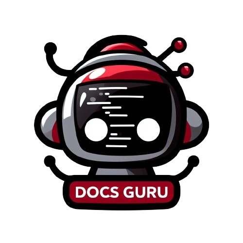

<br>



# Welcome to DocsGuru 🤖👋

**no more need to look through documentations!**

DocsGuru is a powerful AI-powered bot that revolutionizes how you interact with documentation. It enables you to effortlessly navigate through vast knowledge bases and quickly find the answers you need. With its natural language processing capabilities, DocsGuru understands your questions and provides precise, relevant responses in real time.

## Installation

After cloning, open a terminal and run:

* create a virtual environment and activate it.

linux/mac:
```bash
$ python -m venv .docsguru
$ source .docsguru/bin/activate
```
windows:
```bash
$ python -m venv .docsguru
$ .docsguru\Scripts\activate.bat
```

* download dependencies.

```bash
$ pip install -r requirements.txt
```

* run the app.

```bash
$ streamlit run app.py
```

## How to use it?

### After running the app a window wil open up like this.


### To add new documentations.
you need to provide:
* name, will be used to refer to docs.
* link, the documentations docs main page.

this process might take a while, as it scrapes all relevant documentations. and uses `FAISS` to create a vectorstore to be used with the chatbot.
<br>
You can always check your terminal to see the logs. Logs are also created in `logs/tools.log`

### Chat !
select your installed docs from the dropdown. and start chatting !


## Key Features

* **Improved Productivity:** Dedicate more time to productive tasks by spending less time searching for information.

* **Instant Access to Information:** DocsGuru acts as your personal documentation assistant, providing immediate access to the information you seek. No more sifting through lengthy documents – simply ask your question and get the answer directly.

* **Know exactly where to look for:** after giving an answer, DocsGuru will always link back to relevant parts of the documentation, so you can also dig deeper.

## Save your time right now !

Embrace DocsGuru as your go-to resource for accessing and understanding documentation. With its intuitive interface, powerful search capabilities, and AI-powered insights, DocsGuru transforms documentation into a valuable tool for learning, problem-solving, and collaboration.
